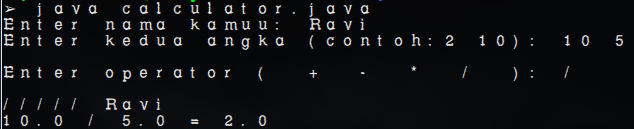

# Java Calculator CLI
a very basic calculator application?

## Screenshots


## Requirements
- Java version 8 or higher.

## Installation
1. Press *Fork* botton (top right the page) to save copy of this project on your account.
2. Clone this project by typing in the bash:
`git clone  git@github.com:syahravi/java-calculator-cli.git`
3. Imported it in Intellij IDEA or any other Java IDE or any other Text Editor.
4. Run the application

Simple way:
`java calculator.java`


```
➢ java calculator.java
Enter nama kamuu: Ravi
Enter kedua angka (contoh:2 10): 10 5

Enter operator (  +  -  *  /  ): /

///// Ravi
10.0 / 5.0 = 2.0
```
